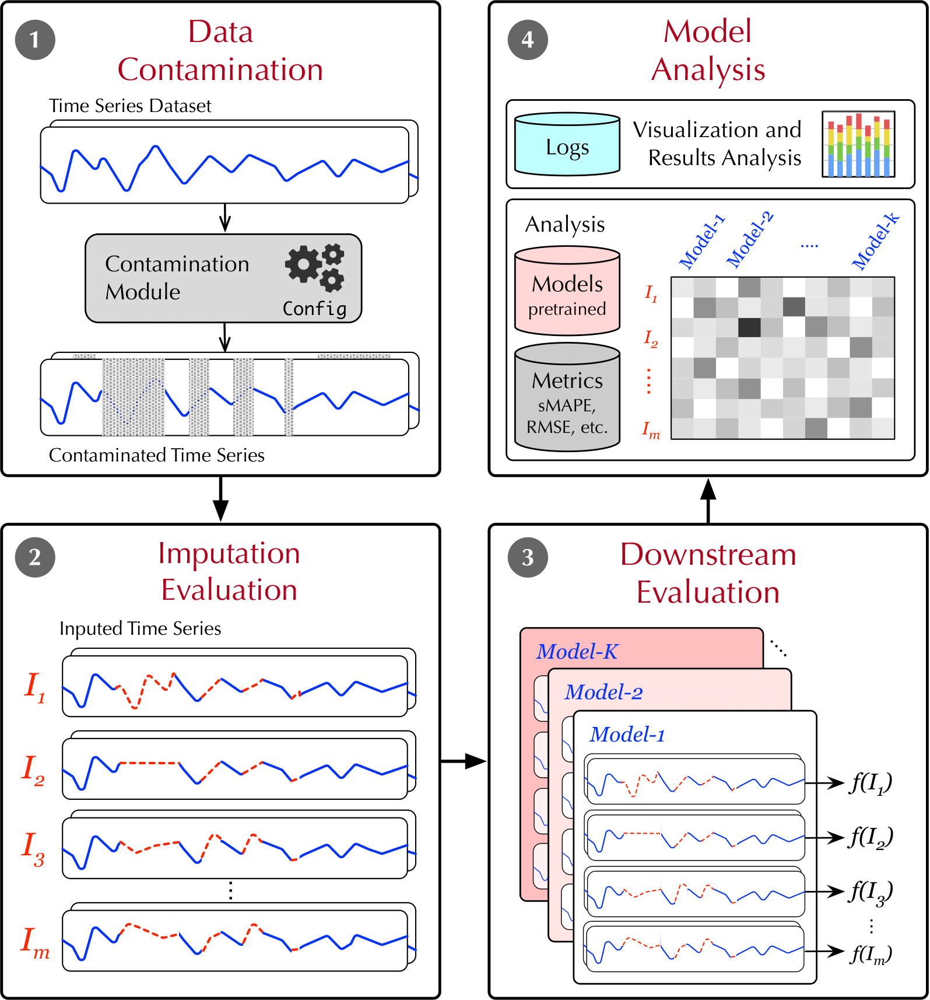

# CleanIMP: A Comprehensive Benchmark to Evaluate the Impact of Imputation on Downstream Tasks

CleanIMP is a unified framework designed to extensively evaluate the downstream effects of a wide variety of
imputation algorithms for time series data. It evaluates two downstream tasks: classification and forecasting
using 89 datasets, 26 downstream techniques, and various contamination scenarios. Technical details can be found in our
paper: Does Cleaning Time Series Really Matter? An Evaluation of the Impact of Imputation on Downstream Tasks (under review at KDD'25) </a>. 

- **Advanced Imputation Algorithms**: The initial list of algorithms we considered is available through [ImputeBench](https://github.com/eXascaleInfolab/bench-vldb20).

- **Datasets**: The classification datasets are accessible through this [link](https://doi.org/10.5281/zenodo.14022916), and the forecasting datasets are available through this [link](https://doi.org/10.5281/zenodo.14023106).


 [**Architecture**](#benchmark-architecture) | [**Prerequisites**](#prerequisites) | [**Build**](#build) | [**Configuration**](#benchmark-configuration) | [**Execution**](#execution) | [**Analysis**](#analysis) | [**Contributors**](#contributors) |

---
## Benchmark Architecture

CleanIMP processes a full dataset by introducing missing data points through a customizable contamination module. It then applies a range of imputation algorithms and evaluates the performance of the imputed time series on downstream tasks by feeding them into various models. Finally, it generates an analysis of the imputation's impact using multiple metrics.
The architecture of our framework is organized into four main modules as follows: (1) Data Contamination, (2) Imputation Evaluation,(3) Downstream Evaluation, and (4) Model Analysis.

<p align="center">

</p>


---


## Prerequisites

- Ubuntu 22 or Ubuntu 24 (including Ubuntu derivatives, e.g., Xubuntu) or the same distribution under WSL.
- Clone this repository
 

---

## Build
- Build the Testing Framework using the installation script located in the root folder 

```bash
    $ sh setup.sh
```
  

## Benchmark Configuration 

- **Datasets**: The datasets will be downloaded by executing the setup script. They are task-dependent and can be found in `WorkDir/_RawDataStorage` in resp. folders `UniClass` or `Forecasting`. 

- **Missing Patterns**: `Scenarios` control the patterns of contamination performed by the benchmark. The available options are listed in the table below.

| Scenario      | Task           | Description  |
| --------      | --------       | --------     |
| miss_percNN   | Classification | contaminate NN% of all time series and vary the size of the missing block from 10% to 80% of the length of the series; NN ∈ {10, 20, ... 50} |
| mc_NN         | Classification | vary the number of contaminated series from 10% to 100%, each affected time series has a missing block of NN% of the length of the series; NN ∈ {10, 20, ... 50} |
| miss_perc_rev | Forecasting    | contaminate a single time series and vary the size of the missing block from 10% to 80% of the length of the series |
| mc_rev        | Forecasting    | vary the number of contaminated series from 10% to 100%, each affected time series has a missing block of 10% of the length of the series |


- **Imputation Algorithms Parameterization**: The list of imputation algorithms and their parameters is provided below. The parameters can be updated in the config file by modifying `algorithm:p00`  where `p` is the name of the parameter and `00` is the value. For example, IMM with the neighborhood size 5 is `IIM:n5`.

| Algorithms | param      | default  | param. descr. | range    |
| --------   | --------   | -------- | --------      | -------- |
| CDRec      | k          | 3        | truncation    | [1, 10]  |
| SVDImp     | k          | 3        | truncation    | [1, 10]  |
| SoftImp    | k          | 3        | truncation    | [1, 10]  |
| STMVL      | n/a        |          |               |          |
| DynaMMo    | k          | 3        | hidden var.   | [1, 10]  |
| IIM        | n          | 3        | neighbors     | [1, 100] |
| GROUSE     | k          | 3        | truncation    | [1, 10]  |
| SVT        | n/a        |          |               |          |
| ROSL       | k          |          | hidden var.   | [1, 10]  |
| TRMF       | k          | 3        | truncation    | [1, 10]  |
| --------   | --------   | -------- | --------      | -------- |
| MeanImp    | n/a        |          |               |          |
| ZeroImp    | n/a        |          |               |          |
| 1NNImp     | n/a        |          |               |          |
| LinearImp  | n/a        |          |               |          |
| knnimp     | n          | 3        | neighbors     | [1, 100] |

- **Downstream Algorithms**: The list of per-task downstream algorithms is provided below (see [sktime](https://www.sktime.net/) and [darts](https://unit8co.github.io/darts/) for documentation).

| Classification | Forecasting        |
| --------       | --------           |
| arsenal        | sf-arima*          |
| stc            | fbprophet          |
| weasel         | hw-add             |
| cboss          | hw-mul             |
| tsf            | bats               |
| catch22        | darts-nbeats       |
| svc            | sf-ets             |
| knn            | ltsf*              |
| itde           | croston            |
| shapedtw       | darts-lstm*        |
| signature      | darts-deepar*      |
| tsfresh        | darts-transformer* |
| cif            |                    |
| proxstump      |                    |

- **Reference**: This parameter controls whether the algorithms are ran on uncontaminated data during the evaluation (downstream) experiment. Available options are listed in the table below.

| Reference        | Description |
| --------         | --------    |
| Both (default)   | Downstream algorithms are executed on contaminated and uncontaminated data |
| NoReference      | Downstream algorithms are executed on contaminated data only |
| ReferenceOnly    | Downstream algorithms are executed on uncontaminated data only |
| ReferenceReplace | Downstream algorithms are executed on uncontaminated data, only overwriting the existing results |

- **Notes**:
  - Downstream algorithms marked with \* are already parallelized. If they are included in the experiment - parallelization has to be disabled on the level on the benchmark by setting the parameter `ParallelizeDownstream` to `False`.
  - Set the values in the config parameters `PerformContamination` and `PerformEvaluation` to `True` to enable a specific type of experiment. The contamination results (upstream) are required to run evaluation experiments (downstream).
  - Standard benchmark behavior is to overwrite existing results in case of overlap with cached results for contaminated data and to not overwrite the results for uncontaminated data.

## Analysis 

- Once the experiment is executed, the analysis routines can be invoked. The general pattern for the command is
```bash
    $ dotnet run config_file.cfg analysis {job_type}:{metric1},{metric2},{metric3}[:aggregation_level]
```

- **Job type**: The table below gives the list of available options with the descriptions for job types and lists the prerequisites to run them (which experiments have to already been executed). Jobs are task-independent.

| Job type      | Requirements  | Description |
| --------      | --------      | --------    |
| simpledump    | None          | Displays basic information about the dataset |
| datachar      | None          | Displays advanced information (features) about the dataset |
| upstream      | Contamination | Displays the upstream experiment results |
| downstream    | Evaluation    | Displays the downstream experiment results |
| bydata        | Evaluation    | Displays the downstream experiment results with a different aggregation mechanism |
| reference     | Evaluation\*  | Displays the evaluation results of the downstream algorithms on uncontaminated data; \* - No experiments on contaminated data are required to run this job, see `Reference` parameter |

- **Metrics**: A list of metrics to be used in the evaluation. Metrics are task-dependent. Note: forecasting metrics need to have forecasting horizon appended to them. Supported values are: (12, 24, 48, 60). E.g. for `smape` metric with the horizon of 24 - the argument is `smape24`.

| Upstream | Description |
| -------- | --------    |
| rmse     | Root Mean Squared Error  |
| mae      | Mean Absolute Error |
| pearson  | Pearson Correlation Coefficient |
| spearman | Spearman Correlation Coefficient |
| MI-k{N}  | Kraskov Mutual Information. {N} - is the neighborhood size. Supported values are 3 and 5. |

| Classification | Description |
| --------       | --------    |
| accuracy       | Accuracy |
| precision      | Precision |
| recall         | Recall |
| f1             | F1-Measure (F-Score) |
| mcc            | Matthew's Correlation Coefficient (also known as Phi coefficient) |

| Forecasting | Description |
| --------    | --------    |
| smape       | Symmetric Mean Absolute Percentage Error |
| rmse        | Root Mean Squared Error  |
| pearson     | Pearson Correlation Coefficient |

- **Aggregation level**: The parameter is optional and only applicable to jobs `upstream`, `downstream` and `bydata`. Aggregation levels are task-independent.

| Level    | Description |
| -------- | --------    |
| all      | (default) Shows a single value per contamination pattern by averaging all contamination levels |
| none     | Shows all levels of contamination as defined by a contamination pattern |
| low      | Shows a single value per contamination pattern by averaging the lower half of contaminations levels |
| high     | Shows a single value per contamination pattern by averaging the upper half of contaminations levels |
| -        | Other more technical aggregations options are available too, refere to the source file `Testing/TestRoutinesAnalysis.cs` for more information |

## Execution

- To produce a curated set of results, run the following command (takes ~ 5 days on a server-grade CPU):
  
```bash
    $ sh full_results.sh
```

The output will be stored in the `Results/` folder, which will be created in the root folder.


## Execution (fine-grained)

- This section gives some examples on how to produce different analysis results.

- The existing config files for classification `config_uniclass_custom.cfg` and `config_forecast_custom.cfg` create new customized experiment runs. Those files contain lists of available options so they can be tweaked to produce a desired experiment. Their default configuration is geared towards a smaller experiment that can be completed in a reasonable timespan.

- To produce the classification and resp. forecasting experiment runs, run the following commands:

```bash
    $ cd TestFramework/
    $ dotnet run ../configs/config_uniclass_custom.cfg
    $ dotnet run ../configs/config_forecast_custom.cfg
```

- Running the configuration file will execute the experiment specified there and cache the upstream/downstream result data.
- To produce the analysis of the runs, a parametrized `analysis` argument needs to be specified after the name of the config file.
  For example, the following command produces the analysis for the classification run using rmse as an upstream metric:

```bash
    $ dotnet run ../configs/config_uniclass_custom.cfg analysis upstream:rmse
```

- To produce results for multiple metrics, or (in this example) for forecasting task the same metrics (smape) but different forecasting horizions (12-36), and aggregate them by dataset one can run the following command:
 ```bash
    $ dotnet run ../configs/config_forecast_custom.cfg analysis downstream:smape12,smape24,smape36:bydata
```

---


## Contributors

- Mourad Khayati (mourad.khayati@unifr.ch)
- Zakhar Tymchenko (zakhar@exascale.info)

---
